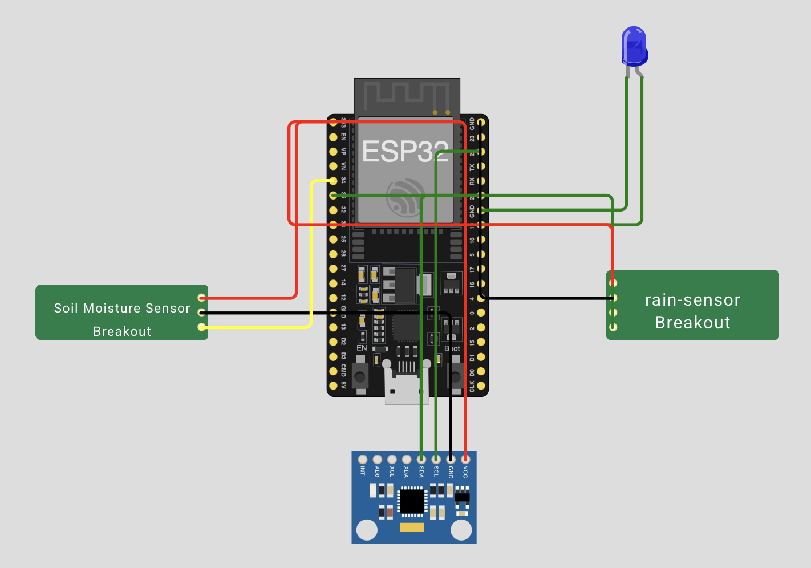

# ALERT-AI: Sistema Inteligente de Alerta de Deslizamentos

O **ALERT-AI** é um sistema completo que une sensores IoT, modelo de machine learning, backend Python, análise estatística em R e notificações automáticas via AWS SNS para detectar e alertar sobre riscos de deslizamento.

---

Fábio Marcos Pedroso Filho - RM 560665
[Linkedin](https://www.linkedin.com/in/pedrosof/)

---

## Estrutura do Projeto

```
.
├── backend.py                          # API Flask com IA, DB e alerta SNS
├── frontend.py                         # Painel web com gráfico
├── sensor_simulador.py                 # Simula envio de dados do sensor
├── sketch.ino                          # Código Arduino para ESP32
├── analise_alerta.R                    # Gera gráficos e salva no DB
├── config.ini                          # Credenciais AWS
├── modelo_risco_deslizamento.joblib    # Modelo IA
├── dados_alertai.db                    # SQLite com leituras, alertas, gráficos
└── static/                             # Repositório de imagens do projeto
```

---

### Diagrama do Sensor


### Wokwi do Sensor
https://wokwi.com/projects/432836568532173825

---

## Requisitos

### Python

```bash
pip install flask pandas joblib boto3 configparser
```

### R

```r
install.packages(c("DBI", "RSQLite", "ggplot2"))
```

---

## ESP32 (sketch.ino)

Dispositivo coleta dados de sensores e envia para o backend:

* Sensor de umidade do solo (A0)
* Sensor de chuva (A1)
* MPU6050 para inclinação (I2C)

LED azul:

* Aceso = coletando dados
* Apagado = inativo

---

## Backend Flask

Recebe os dados, executa IA, grava no DB e aciona alerta via SNS (1 alerta a cada 30 min no máximo). O backend utiliza um modelo de machine learning para classificar o risco e dispara alertas via AWS SNS.

---

### Funcionalidades

* Previsão de risco de deslizamento com base em:

  * Umidade do solo (%);
  * Nível de chuva (%);
  * Inclinação do terreno (graus).
* Registro de todas as leituras recebidas em banco SQLite.
* Disparo de alerta por SNS da AWS quando o risco é classificado como **alto**.
* Controle de intervalo de envio de alertas (30 minutos).

---

### Endpoints

### POST `/prever`

Recebe os dados do sensor e retorna a classificação de risco.

#### Exemplo de request JSON:

```json
{
  "umidade": 78.5,
  "inclinacao": 22.3,
  "chuva": 65.0
}
```

#### Exemplo de resposta:

```json
{
  "status": "ok",
  "mensagem": "Leitura registrada com risco alto."
}
```

---

## Estrutura do banco SQLite (`dados_alertai.db`)

### Tabela `leituras`

Registra cada leitura recebida do sensor.

```sql
id INTEGER PRIMARY KEY
umidade REAL
inclinacao REAL
chuva REAL
risco TEXT
timestamp DATETIME
```

### Tabela `alertas`

Registra o timestamp de cada alerta disparado.

```sql
id INTEGER PRIMARY KEY
enviado_em DATETIME
```

---

## Configuração do AWS SNS (`config.ini`)

```ini
[aws]
access_key = SUA_ACCESS_KEY
secret_key = SUA_SECRET_KEY
region = SEU_REGION
sns_topic_arn = SEU_TOPIC
```

---

## Análise Gráfica (R)

Este script R realiza uma análise exploratória de dados coletados por sensores e armazenados no banco de dados `dados_alertai.db`. Os dados são utilizados para gerar gráficos informativos, que são convertidos em imagens e armazenados diretamente no banco, em formato BLOB.

### Execução

```bash
Rscript analise_alerta.R
```

### Gráficos:

   * **Gráfico 1**: Dispersão entre `chuva` e `inclinacao`, colorido por `risco`
   * **Gráfico 2**: Boxplot de `umidade` por `risco`
   * **Gráfico 3**: Histograma da distribuição geral da `umidade`

---

## Frontend Web

Este componente Flask fornece uma interface web para visualização dos gráficos gerados pela solução ALERT-AI. Os gráficos são armazenados como BLOBs no banco de dados SQLite e são extraídos dinamicamente para exibição.

### Funcionalidades

* Renderiza a página HTML contendo todos os gráficos configurados.
* Lê os gráficos diretamente do banco de dados `dados_alertai.db`.
* Salva os gráficos no diretório `static/` para exibição no navegador.

### Gráficos Suportados

* `grafico_risco`: Dispersão entre chuva, inclinação e risco.
* `grafico_umidade_boxplot`: Boxplot da umidade do solo.
* `grafico_umidade_hist`: Histograma da umidade do solo.

### Como Executar

```bash
python frontend.py
```

A aplicação ficará acessível em: [http://localhost:8080](http://localhost:8080)

### Exemplo de Tela

```html
<h2>Grafico Risco</h2>

```

### Observações

* Os gráficos devem ser previamente inseridos no banco pela rotina de análise em R.
* O sistema é tolerante a falhas: gráficos ausentes são sinalizados na tela.

---

## Treinamento inicial do modelo

Este script treina um modelo de machine learning para classificação do risco de deslizamento de terra com base em três variáveis principais:

* Umidade do solo (%)
* Inclinação do terreno (graus)
* Chuva acumulada (%)

### Objetivo

Criar um modelo preditivo simples com dados simulados para categorizar o risco como:

* `0` - Baixo
* `1` - Médio
* `2` - Alto

### Como Executar

```bash
python treinar_modelo.py
```

### Isso irá gerar:

```
modelo_risco_deslizamento.joblib
```

### Etapas Realizadas

1. **Simulação de dados:**

   * Um pequeno dataset com 10 instâncias contendo dados realistas de sensores simulados.

2. **Mapeamento de classes:**

   * O campo `risco` é convertido de texto para valores numéricos.

3. **Treinamento do modelo:**

   * É utilizado um classificador `RandomForestClassifier` com 100 árvores e `random_state=42` para garantir reprodutibilidade.

4. **Validação simples:**

   * Split dos dados em treino e teste (80/20).

5. **Exportação:**

   * O modelo treinado é salvo localmente em um arquivo chamado `modelo_risco_deslizamento.joblib`.


Este modelo pode ser carregado por outros componentes como o backend Flask da solução ALERT-AI para prever o risco com base em dados recebidos por sensores.

---

## Simulador de Sensor - ALERT-AI

Este script em Python simula o comportamento de sensores físicos utilizados no projeto **ALERT-AI**, que visa monitorar riscos de deslizamentos de terra. Ele envia dados fictícios para o backend da aplicação, reproduzindo o funcionamento de sensores reais de umidade do solo, inclinação e chuva.

### Execução

```bash
python simulador_sensor.py
```

### Parâmetros

* `qtd`: quantidade de leituras a enviar (padrão: 10)
* `intervalo`: tempo entre as leituras em segundos (padrão: 1.5)

### Comportamento

Para cada ciclo:

1. Simula a coleta de dados (LED ON)
2. Envia os dados via HTTP POST para o backend
3. Exibe a resposta recebida (incluindo risco previsto)
4. Aguarda o próximo ciclo (LED OFF)

### Backend esperado

A URL do backend é configurada pela constante:

```python
BACKEND_URL = "http://localhost:6000/prever"
```

Altere conforme o IP/porta do seu backend Flask.

###  Exemplo de Saída

```text
[1] LED ON → Coletando dados...
→ Enviando: {'umidade': 58.2, 'inclinacao': 12.45, 'chuva': 20.31}
✔️ Enviado com sucesso → Resposta: {'status': 'ok', 'mensagem': 'Leitura registrada com risco medio.'}
[1] LED OFF → Aguardando próxima leitura...
```

---

## Banco de Dados SQLite

Tabela `leituras`: dados dos sensores

Tabela `graficos`: imagens PNG geradas em R

Tabela `alertas`: controle do último alerta SNS emitido

---

## Futuro

* Dashboard com filtros interativos
* Conexão com sensores reais ESP32 via MQTT
* Auto-retrain do modelo com dados reais

---

## 📄 Licença

Projeto acadêmico FIAP - Global Solution 2025.1
